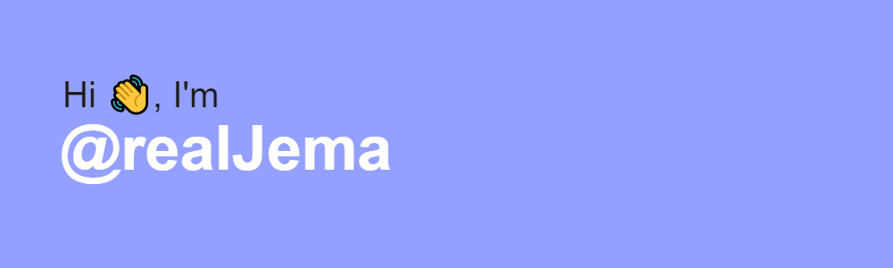

- 🔭 I’m currently working on [NATIVE](https://github.com/realJema/React-Playground.git)

- 🌱 I’m currently learning **Python, Android, Reactjs, Graphic Design**

- 👯 I’m looking to collaborate on [Facebook](https://github.com/facebook/react-native)

- 🤝 I’m looking for help with [Jarvis AI](https://github.com/realJema/Jarvis)

- 👨‍💻 All of my projects are available at [native237.com](native237.com)

- 📝 I regulary write articles on [http://realjema.native237.com/](http://realjema.native237.com/)

- 💬 Ask me about **Javascript, Wordpress, AI**

- 📫 How to reach me **realjema@gmail.com**

- ⚡ Fun fact **I don't like Coffee**

&nbsp;

